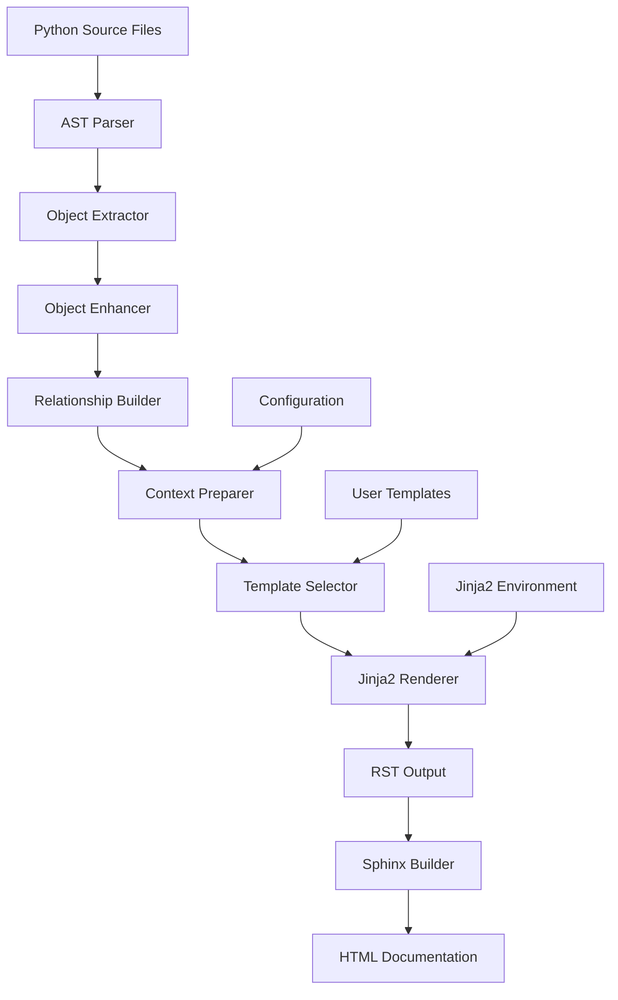

# Technical Deep Dive: Jinja2 and AutoAPI Template System

**Document**: Technical Deep Dive  
**Part of**: Issue #6 - AutoAPI Jinja2 Template Improvement  
**Created**: 2025-01-30  
**Scope**: In-depth technical analysis of template systems

## Table of Contents

1. [Jinja2 Architecture](#jinja2-architecture)
2. [AutoAPI Template Pipeline](#autoapi-template-pipeline)
3. [Template Context Data Flow](#template-context-data-flow)
4. [Advanced Jinja2 Techniques](#advanced-jinja2-techniques)
5. [AutoAPI Internals](#autoapi-internals)
6. [Performance Considerations](#performance-considerations)
7. [Security Implications](#security-implications)

## Jinja2 Architecture

### Template Compilation Process

Jinja2 operates through a sophisticated compilation pipeline that transforms template text into executable Python code. Understanding this process is crucial for creating efficient custom templates.

#### 1. Lexical Analysis (Lexing)

The lexer tokenizes the template text into meaningful symbols:

```python
# Example of token stream
{{ user.name | upper }}  →  [
    TOKEN_VARIABLE_BEGIN: '{{',
    TOKEN_NAME: 'user',
    TOKEN_DOT: '.',
    TOKEN_NAME: 'name',
    TOKEN_PIPE: '|',
    TOKEN_NAME: 'upper',
    TOKEN_VARIABLE_END: '}}'
]
```

The lexer recognizes several token types:

- **Delimiters**: `{{`, `}}`, ``, `{#`, `#}`
- **Operators**: `.`, `|`, `+`, `-`, `*`, `/`, `==`, `!=`
- **Keywords**: `if`, `for`, `block`, `extends`, `include`
- **Names**: Variable and function identifiers
- **Literals**: Strings, numbers, booleans

#### 2. Syntactic Analysis (Parsing)

The parser constructs an Abstract Syntax Tree (AST) from tokens:

```python
# AST representation
Template(
    body=[
        Output(
            nodes=[
                Filter(
                    node=Getattr(
                        node=Name(name='user'),
                        attr='name'
                    ),
                    name='upper',
                    args=[]
                )
            ]
        )
    ]
)
```

Parser features:

- **Recursive descent parsing** for nested structures
- **Operator precedence** handling
- **Error recovery** for better error messages
- **Line tracking** for debugging

#### 3. Semantic Analysis

The compiler performs several semantic checks:

- **Variable resolution** in the current context
- **Filter existence** verification
- **Template inheritance** validation
- **Macro signature** checking

#### 4. Code Generation

The AST is transformed into Python bytecode:

```python
# Generated Python code (simplified)
def root(context):
    l_user = context.resolve('user')
    l_name = environment.getattr(l_user, 'name')
    l_filtered = environment.call_filter('upper', l_name)
    yield l_filtered
```

### Template Environment

The Jinja2 Environment is the central configuration object:

```python
from jinja2 import Environment, FileSystemLoader, select_autoescape

env = Environment(
    # Template loading
    loader=FileSystemLoader('templates'),

    # Auto-escaping for security
    autoescape=select_autoescape(['html', 'xml']),

    # Performance options
    cache_size=400,
    auto_reload=True,

    # Syntax customization
    block_start_string='',
    variable_start_string='{{',
    variable_end_string='}}',
    comment_start_string='{#',
    comment_end_string='#}',

    # Behavior options
    trim_blocks=True,
    lstrip_blocks=True,
    keep_trailing_newline=False,

    # Advanced features
    extensions=['jinja2.ext.do', 'jinja2.ext.loopcontrols'],

    # Optimization
    optimized=True,

    # Undefined handling
    undefined=StrictUndefined,
)
```

### Template Inheritance Mechanism

Jinja2's template inheritance is implemented through a sophisticated block system:

```jinja2
{# base.html #}
<!DOCTYPE html>
<html>
<head>
    
    <title>Default Title</title>
    
</head>
<body>
    
    <h1>Welcome</h1>
    
    Default content
    
    
</body>
</html>

{# child.html #}


{{ super() }} - My Page


<p>This replaces the default content.</p>
{{ super() }}  {# Include parent content #}

```

Block resolution algorithm:

1. **Child blocks override** parent blocks by default
2. **`super()`** includes parent block content
3. **Nested blocks** create hierarchical overrides
4. **Dynamic inheritance** via variables: ``

### Macro System Deep Dive

Macros are Jinja2's answer to reusable template functions:

```jinja2
{# Advanced macro with multiple features #}

    
    
    

    <div class="form-group {{ 'has-error' if errors else '' }}">
        <label for="{{ field.id }}">{{ label }}</label>

        {{ field(class=css_classes + ' form-control', **dict(extra_attrs)) }}

        
            
            <span class="help-block">{{ error }}</span>
            
        

        
        <p class="help-text">{{ help_text }}</p>
        
    </div>


{# Macro with recursive calling #}

    <ul class="tree-level-{{ level }}">
    
        <li>
            {{ node.name }}
            
                {{ render_tree(node.children, level + 1) }}
            
        </li>
    
    </ul>

```

Macro features:

- **Default parameters** with Python-like syntax
- **Keyword arguments** via `**kwargs`
- **Variable scope** isolation
- **Recursive calls** supported
- **Return values** via `` blocks

## AutoAPI Template Pipeline

### Template Discovery Process

AutoAPI uses a sophisticated template resolution system:

```python
# Template search order
template_paths = [
    # 1. User-defined template directory
    user_template_dir / language / f"{obj_type}.rst",

    # 2. Package-specific overrides
    package_templates / language / f"{obj_type}.rst",

    # 3. AutoAPI default templates
    autoapi_templates / language / f"{obj_type}.rst",

    # 4. Fallback generic template
    autoapi_templates / language / "base.rst"
]
```

### Object Processing Pipeline

AutoAPI processes Python objects through multiple stages:

#### 1. Object Discovery

```python
# AutoAPI discovers objects via AST parsing
class PythonSphinxMapper:
    def load(self, path):
        # Parse Python files
        for file_path in self.find_files(path):
            # Parse AST
            module = parse_file(file_path)
            # Extract objects
            objects = self.extract_objects(module)
            # Build relationships
            self.build_hierarchy(objects)
```

#### 2. Object Enhancement

```python
# Objects are enhanced with additional metadata
class PythonObject:
    def __init__(self, data):
        self.name = data['name']
        self.id = data['full_name']
        self.type = data['type']

        # Enhance with relationships
        self.children = []
        self.parents = []

        # Add computed properties
        self.is_private = self.name.startswith('_')
        self.is_special = self.name.startswith('__')
        self.is_public = not self.is_private

        # Parse docstring
        self.docstring = parse_docstring(data.get('doc', ''))
        self.short_description = self.docstring.summary
        self.long_description = self.docstring.description
```

#### 3. Context Preparation

```python
# Context is prepared for template rendering
def prepare_context(obj, config):
    return {
        'obj': obj,
        'autoapi_options': config.autoapi_options,
        'include_summaries': 'include-summaries' in config.autoapi_options,
        'own_page_types': config.autoapi_own_page_types,
        'sphinx_version': sphinx.__version__,

        # Additional helpers
        'autoapi_type': obj.type,
        'display': should_display(obj, config),

        # Computed values
        'show_inheritance': obj.bases and 'show-inheritance' in config.autoapi_options,
        'show_source': 'show-source-link' in config.autoapi_options,
    }
```

### Template Rendering Engine

AutoAPI extends Jinja2 with domain-specific functionality:

```python
class AutoAPIRenderer:
    def __init__(self, app):
        self.app = app
        self.env = self.create_jinja_env()

    def create_jinja_env(self):
        env = Environment(
            loader=FileSystemLoader(self.get_template_dirs()),
            undefined=StrictUndefined,
            trim_blocks=True,
            lstrip_blocks=True,
        )

        # Add AutoAPI-specific features
        env.filters.update(self.get_filters())
        env.tests.update(self.get_tests())
        env.globals.update(self.get_globals())

        # Call user customization
        self.app.emit('autoapi-prepare-jinja-env', env)

        return env
```

## Template Context Data Flow

### Data Flow Diagram



### Context Object Structure

The complete context object passed to templates:

```python
context = {
    # Primary object being documented
    'obj': {
        # Identity
        'id': 'package.module.ClassName',
        'name': 'ClassName',
        'type': 'class',  # class|function|method|module|package|attribute|data

        # Location
        'file_path': '/path/to/file.py',
        'line_number': 42,
        'source': 'source code string',

        # Documentation
        'docstring': 'Complete docstring',
        'short_description': 'First line',
        'long_description': 'Rest of docstring',
        'examples': ['example code blocks'],

        # Relationships
        'module': 'package.module',
        'package': 'package',
        'all': ['exported', 'names'],

        # Class-specific
        'bases': [BaseClassObject, ...],
        'subclasses': [SubclassObject, ...],
        'methods': [MethodObject, ...],
        'attributes': [AttributeObject, ...],
        'properties': [PropertyObject, ...],
        'is_abstract': False,
        'is_exception': False,
        'metaclass': 'type',

        # Function-specific
        'args': ['arg1', 'arg2'],
        'defaults': ['default1', None],
        'kwonlyargs': ['kwonly1'],
        'kwonlydefaults': {'kwonly1': 'default'},
        'vararg': 'args',
        'kwarg': 'kwargs',
        'signature': '(arg1, arg2="default", *args, **kwargs)',
        'return_annotation': 'str',
        'is_async': False,
        'is_generator': False,
        'is_coroutine': False,
        'decorators': ['@decorator1', '@decorator2'],

        # Method-specific
        'is_classmethod': False,
        'is_staticmethod': False,
        'is_property': False,
        'property_getter': None,
        'property_setter': None,
        'property_deleter': None,

        # Visibility
        'is_private': False,
        'is_special': False,
        'is_public': True,
        'imported': False,

        # Computed properties
        'children': [ChildObjects, ...],
        'parents': [ParentObjects, ...],
        'member_order': 100,
    },

    # Configuration
    'autoapi_options': [
        'members',
        'undoc-members',
        'show-inheritance',
        'show-module-summary',
        'imported-members',
        'exclude-members',
    ],

    # Display control
    'include_summaries': True,
    'own_page_types': ['module', 'class'],
    'display': True,

    # Environment
    'sphinx_version': '7.0.0',
    'autoapi_type': 'class',

    # Helpers
    'show_inheritance': True,
    'show_source': True,
}
```

## Advanced Jinja2 Techniques

### Custom Filter Implementation

Creating sophisticated filters for AutoAPI:

```python
# pydevelop_docs/template_helpers/filters.py

import re
from typing import Any, List, Optional
from jinja2 import Environment

class AdvancedFilters:
    """Advanced Jinja2 filters for AutoAPI templates."""

    @staticmethod
    def smart_truncate(text: str, length: int = 100,
                      suffix: str = '...',
                      preserve_words: bool = True) -> str:
        """Intelligently truncate text preserving word boundaries."""
        if len(text) <= length:
            return text

        if preserve_words:
            # Find last space before length limit
            truncated = text[:length]
            last_space = truncated.rfind(' ')
            if last_space > length * 0.8:  # If space is reasonably close
                truncated = truncated[:last_space]
        else:
            truncated = text[:length]

        # Remove trailing punctuation
        truncated = re.sub(r'[.,;:!?]+$', '', truncated)

        return truncated + suffix

    @staticmethod
    def extract_summary(docstring: str,
                       sentences: int = 2,
                       max_length: int = 200) -> str:
        """Extract a meaningful summary from docstring."""
        if not docstring:
            return ""

        # Split into sentences
        sentence_pattern = r'(?<=[.!?])\s+(?=[A-Z])'
        parts = re.split(sentence_pattern, docstring.strip())

        # Take requested number of sentences
        summary_parts = parts[:sentences]
        summary = ' '.join(summary_parts)

        # Apply length limit
        if len(summary) > max_length:
            summary = AdvancedFilters.smart_truncate(summary, max_length)

        return summary

    @staticmethod
    def format_signature(obj: dict,
                        max_length: int = 80,
                        indent: str = '    ') -> str:
        """Format function signature with smart line breaking."""
        if not hasattr(obj, 'signature'):
            return ""

        sig = obj.signature
        if len(sig) <= max_length:
            return sig

        # Parse signature for intelligent breaking
        func_match = re.match(r'^(\w+)\((.*)\)(.*)$', sig)
        if not func_match:
            return sig

        func_name = func_match.group(1)
        params = func_match.group(2)
        return_annotation = func_match.group(3)

        # Split parameters
        param_list = []
        depth = 0
        current_param = []

        for char in params:
            if char in '([{':
                depth += 1
            elif char in ')]}':
                depth -= 1
            elif char == ',' and depth == 0:
                param_list.append(''.join(current_param).strip())
                current_param = []
                continue
            current_param.append(char)

        if current_param:
            param_list.append(''.join(current_param).strip())

        # Format with line breaks
        if len(param_list) > 3 or any(len(p) > 30 for p in param_list):
            formatted_params = f',\n{indent}'.join(param_list)
            return f"{func_name}(\n{indent}{formatted_params}\n){return_annotation}"
        else:
            return sig

    @staticmethod
    def group_by_category(items: List[dict]) -> dict:
        """Group items by their category with smart ordering."""
        categories = {
            'properties': [],
            'public_methods': [],
            'private_methods': [],
            'special_methods': [],
            'class_methods': [],
            'static_methods': [],
            'attributes': [],
        }

        for item in items:
            if item.get('is_property'):
                categories['properties'].append(item)
            elif item.get('is_classmethod'):
                categories['class_methods'].append(item)
            elif item.get('is_staticmethod'):
                categories['static_methods'].append(item)
            elif item.get('name', '').startswith('__'):
                categories['special_methods'].append(item)
            elif item.get('name', '').startswith('_'):
                categories['private_methods'].append(item)
            elif item.get('type') == 'method':
                categories['public_methods'].append(item)
            else:
                categories['attributes'].append(item)

        # Sort within categories
        for category in categories.values():
            category.sort(key=lambda x: x.get('name', ''))

        return categories

    @staticmethod
    def highlight_types(annotation: str) -> str:
        """Add semantic highlighting to type annotations."""
        if not annotation:
            return ""

        # Common type patterns
        patterns = [
            (r'\b(int|str|float|bool|bytes|None)\b', 'primitive'),
            (r'\b(List|Dict|Set|Tuple|Optional|Union|Any)\b', 'generic'),
            (r'\b(BaseModel|Agent|Tool)\b', 'custom'),
            (r'(?<!\w)_\w+', 'private'),
        ]

        highlighted = annotation
        for pattern, css_class in patterns:
            highlighted = re.sub(
                pattern,
                f'<span class="type-{css_class}">\\g<0></span>',
                highlighted
            )

        return highlighted


def register_filters(env: Environment):
    """Register all custom filters with Jinja2 environment."""
    filters = AdvancedFilters()
    env.filters.update({
        'smart_truncate': filters.smart_truncate,
        'extract_summary': filters.extract_summary,
        'format_signature': filters.format_signature,
        'group_by_category': filters.group_by_category,
        'highlight_types': filters.highlight_types,
    })
```

### Custom Test Implementation

```python
# pydevelop_docs/template_helpers/tests.py

class AdvancedTests:
    """Advanced Jinja2 tests for AutoAPI templates."""

    @staticmethod
    def is_pydantic_model(obj: dict) -> bool:
        """Check if object is a Pydantic model."""
        if obj.get('type') != 'class':
            return False

        bases = obj.get('bases', [])
        for base in bases:
            base_name = base.get('name', '') if isinstance(base, dict) else str(base)
            if 'BaseModel' in base_name or 'pydantic' in base_name.lower():
                return True

        # Check imports
        module = obj.get('module', '')
        if 'pydantic' in module:
            return True

        return False

    @staticmethod
    def is_agent_class(obj: dict) -> bool:
        """Check if object is an Agent class."""
        if obj.get('type') != 'class':
            return False

        # Check inheritance
        bases = obj.get('bases', [])
        for base in bases:
            base_name = base.get('name', '') if isinstance(base, dict) else str(base)
            if 'Agent' in base_name:
                return True

        # Check methods
        methods = obj.get('methods', [])
        agent_methods = {'run', 'arun', 'invoke', '__call__'}
        method_names = {m.get('name', '') for m in methods}
        if method_names & agent_methods:
            return True

        return False

    @staticmethod
    def has_complex_inheritance(obj: dict, depth: int = 2) -> bool:
        """Check if object has complex inheritance hierarchy."""
        bases = obj.get('bases', [])
        if len(bases) > depth:
            return True

        # Check for multiple inheritance
        if len(bases) > 1:
            return True

        # Check for deep inheritance
        for base in bases:
            if isinstance(base, dict) and base.get('bases'):
                return True

        return False

    @staticmethod
    def is_public_api(obj: dict) -> bool:
        """Check if object is part of public API."""
        name = obj.get('name', '')

        # Private names
        if name.startswith('_') and not name.startswith('__'):
            return False

        # Check __all__
        module_all = obj.get('module_all', [])
        if module_all and name not in module_all:
            return False

        # Imported objects
        if obj.get('imported') and 'imported-members' not in obj.get('autoapi_options', []):
            return False

        return True


def register_tests(env: Environment):
    """Register all custom tests with Jinja2 environment."""
    tests = AdvancedTests()
    env.tests.update({
        'pydantic_model': tests.is_pydantic_model,
        'agent_class': tests.is_agent_class,
        'complex_inheritance': tests.has_complex_inheritance,
        'public_api': tests.is_public_api,
    })
```

## AutoAPI Internals

### AST Processing Engine

AutoAPI uses Python's `ast` module for deep code analysis:

```python
# Simplified version of AutoAPI's AST processor
import ast
from typing import Dict, List, Any

class ASTProcessor(ast.NodeVisitor):
    """Process Python AST to extract documentation objects."""

    def __init__(self):
        self.objects = []
        self.current_class = None
        self.imports = {}

    def visit_ClassDef(self, node: ast.ClassDef) -> None:
        """Extract class information."""
        class_obj = {
            'type': 'class',
            'name': node.name,
            'line_number': node.lineno,
            'decorators': [self.get_decorator_name(d) for d in node.decorator_list],
            'bases': [self.get_name(base) for base in node.bases],
            'docstring': ast.get_docstring(node),
            'methods': [],
            'attributes': [],
            'is_abstract': self.is_abstract_class(node),
        }

        # Store current class context
        old_class = self.current_class
        self.current_class = class_obj

        # Visit class body
        self.generic_visit(node)

        # Restore context
        self.current_class = old_class
        self.objects.append(class_obj)

    def visit_FunctionDef(self, node: ast.FunctionDef) -> None:
        """Extract function/method information."""
        func_obj = {
            'type': 'method' if self.current_class else 'function',
            'name': node.name,
            'line_number': node.lineno,
            'decorators': [self.get_decorator_name(d) for d in node.decorator_list],
            'docstring': ast.get_docstring(node),
            'args': self.extract_arguments(node.args),
            'returns': self.get_annotation(node.returns),
            'is_async': isinstance(node, ast.AsyncFunctionDef),
            'is_generator': self.is_generator(node),
        }

        # Add to current context
        if self.current_class:
            self.current_class['methods'].append(func_obj)
        else:
            self.objects.append(func_obj)

    def extract_arguments(self, args: ast.arguments) -> Dict[str, Any]:
        """Extract detailed argument information."""
        return {
            'args': [arg.arg for arg in args.args],
            'defaults': [self.get_default_value(d) for d in args.defaults],
            'vararg': args.vararg.arg if args.vararg else None,
            'kwarg': args.kwarg.arg if args.kwarg else None,
            'kwonlyargs': [arg.arg for arg in args.kwonlyargs],
            'kwonlydefaults': {
                arg.arg: self.get_default_value(args.kw_defaults[i])
                for i, arg in enumerate(args.kwonlyargs)
                if i < len(args.kw_defaults) and args.kw_defaults[i]
            },
            'annotations': {
                arg.arg: self.get_annotation(arg.annotation)
                for arg in args.args + args.kwonlyargs
                if arg.annotation
            },
        }
```

### Docstring Processing

AutoAPI includes sophisticated docstring parsing:

```python
# Docstring parsing with multiple format support
from docstring_parser import parse as parse_docstring
from typing import Optional, List, Dict

class DocstringProcessor:
    """Process docstrings in multiple formats."""

    @staticmethod
    def parse_google_style(docstring: str) -> Dict[str, Any]:
        """Parse Google-style docstrings."""
        parsed = parse_docstring(docstring, style='google')
        return {
            'summary': parsed.short_description,
            'description': parsed.long_description,
            'args': [
                {
                    'name': param.arg_name,
                    'type': param.type_name,
                    'description': param.description,
                    'optional': param.is_optional,
                    'default': param.default,
                }
                for param in parsed.params
            ],
            'returns': {
                'type': parsed.returns.type_name if parsed.returns else None,
                'description': parsed.returns.description if parsed.returns else None,
            },
            'raises': [
                {
                    'type': raises.type_name,
                    'description': raises.description,
                }
                for raises in parsed.raises
            ],
            'examples': [example.description for example in parsed.examples],
            'notes': [note.description for note in parsed.notes],
        }

    @staticmethod
    def parse_numpy_style(docstring: str) -> Dict[str, Any]:
        """Parse NumPy-style docstrings."""
        # Similar implementation for NumPy style
        pass

    @staticmethod
    def parse_sphinx_style(docstring: str) -> Dict[str, Any]:
        """Parse Sphinx-style docstrings."""
        # Implementation for Sphinx style
        pass
```

## Performance Considerations

### Template Optimization Strategies

#### 1. Template Caching

```python
# Enable template caching in production
def setup_template_caching(app):
    if not app.config.autoapi_debug:
        # Enable bytecode caching
        app.config.autoapi_template_cache_size = 1000

        # Use compiled templates
        from jinja2 import FileSystemBytecodeCache
        cache_dir = app.outdir / '_autoapi_cache'
        cache_dir.mkdir(exist_ok=True)

        env.bytecode_cache = FileSystemBytecodeCache(str(cache_dir))
```

#### 2. Lazy Loading

```jinja2
{# Use lazy loading for expensive operations #}

    
        <div class="inheritance-diagram" data-lazy-load="true">
            <script>
                // Load diagram on demand
                document.addEventListener('DOMContentLoaded', function() {
                    loadInheritanceDiagram('{{ obj.id }}');
                });
            </script>
        </div>
    

```

#### 3. Template Complexity Reduction

```jinja2
{# BAD: Complex logic in template #}

    
        
            
                
                    {# Render as property #}
                
            
        
    


{# GOOD: Pre-process in Python #}

    {{ render_method(method) }}

```

### Memory Optimization

```python
# Optimize memory usage for large projects
class MemoryEfficientRenderer:
    def __init__(self):
        self.template_cache = LRUCache(maxsize=500)

    def render_object(self, obj, template_name):
        # Stream rendering for large objects
        if obj.get('is_large'):
            return self.stream_render(obj, template_name)
        else:
            return self.standard_render(obj, template_name)

    def stream_render(self, obj, template_name):
        """Stream rendering for memory efficiency."""
        template = self.get_template(template_name)

        # Use generator for streaming
        def generate():
            for chunk in template.stream(obj=obj):
                yield chunk

        return ''.join(generate())
```

## Security Implications

### Template Security Best Practices

#### 1. Auto-escaping Configuration

```python
# Configure auto-escaping for security
from jinja2 import select_autoescape

env = Environment(
    autoescape=select_autoescape(
        enabled_extensions=('html', 'htm', 'xml', 'rst'),
        default_for_string=True,
        default=True,
    )
)
```

#### 2. Sandboxed Environment

```python
# Use sandboxed environment for user templates
from jinja2.sandbox import SandboxedEnvironment

class SecureAutoAPIEnvironment(SandboxedEnvironment):
    def is_safe_attribute(self, obj, attr, value):
        # Restrict access to sensitive attributes
        if attr.startswith('_'):
            return False
        if attr in ['__class__', '__globals__', '__code__']:
            return False
        return super().is_safe_attribute(obj, attr, value)
```

#### 3. Template Injection Prevention

```jinja2
{# UNSAFE: Direct string interpolation #}
{{ "User input: " + user_data }}

{# SAFE: Use filters #}
{{ user_data|escape }}
{{ user_data|urlencode }}

{# SAFE: Use Markup for trusted content #}
{{ trusted_html|safe }}
```

### Content Security

```python
# Implement content security for generated documentation
class ContentSecurityPolicy:
    @staticmethod
    def sanitize_docstring(docstring: str) -> str:
        """Remove potentially unsafe content from docstrings."""
        # Remove script tags
        docstring = re.sub(r'<script[^>]*>.*?</script>', '', docstring, flags=re.DOTALL)

        # Remove event handlers
        docstring = re.sub(r'on\w+\s*=\s*["\'][^"\']*["\']', '', docstring)

        # Escape special characters
        docstring = docstring.replace('<', '&lt;').replace('>', '&gt;')

        return docstring
```

This comprehensive technical deep dive provides the foundational knowledge needed to implement sophisticated custom templates for AutoAPI using Jinja2.
