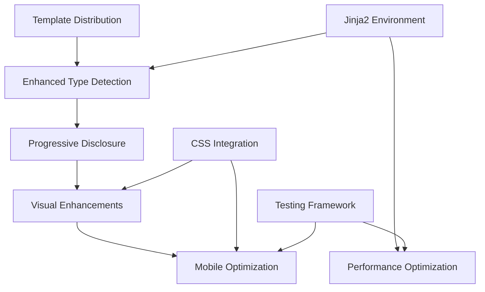

# Issue #6 Research Centralization: Complete AutoAPI Template Knowledge Base

**Document**: Research Centralization & Organization  
**Part of**: Issue #6 - AutoAPI Jinja2 Template Improvement  
**Created**: 2025-01-30  
**Status**: Comprehensive Knowledge Base  
**Tags**: #research #autoapi #jinja2 #templates #centralization

## Table of Contents

1. [Knowledge Base Organization](#knowledge-base-organization)
2. [Research Taxonomy](#research-taxonomy)
3. [Technical Knowledge Consolidation](#technical-knowledge-consolidation)
4. [Implementation Patterns Catalog](#implementation-patterns-catalog)
5. [Current State Analysis](#current-state-analysis)
6. [Reference Library](#reference-library)
7. [Quick Access Index](#quick-access-index)

## Knowledge Base Organization

### **Research Documents Structure**

```
issue_06/
├── 📋 issue_06_autoapi_jinja2_templates.md      # Main issue definition
├── 📊 issue_06_comprehensive_guide.md           # Implementation roadmap
├── 🔬 01_technical_deep_dive.md                 # Technical architecture
├── 🛠️ 02_implementation_patterns.md             # Practical patterns
├── 📝 03_template_examples.md                   # Ready-to-use templates
├── 🎯 04_research_centralization.md             # This document
└── 🚨 05_current_issues_and_fixes.md            # Issues & solutions

Supporting Files:
├── jinja2_research_comprehensive.md             # Pure Jinja2 research
├── autoapi_template_research.md                 # AutoAPI-specific research
└── issue_06_cheat_sheet.md                      # Quick reference
```

### **Knowledge Categorization System**

#### **🏷️ Tag System**

- `#fundamentals` - Core concepts and principles
- `#architecture` - System design and structure
- `#patterns` - Reusable implementation patterns
- `#examples` - Code examples and templates
- `#performance` - Optimization and efficiency
- `#testing` - Testing strategies and approaches
- `#issues` - Problems and solutions
- `#implementation` - Practical implementation guides

#### **📊 Priority Levels**

- **🔴 Critical** - Essential for basic functionality
- **🟡 High** - Important for good user experience
- **🟢 Medium** - Valuable enhancements
- **🔵 Low** - Nice-to-have features

#### **📈 Implementation Status**

- ✅ **Completed** - Fully implemented and tested
- 🔄 **In Progress** - Currently being worked on
- 📅 **Planned** - Scheduled for implementation
- 💡 **Research** - Still in research phase
- ❌ **Blocked** - Cannot proceed due to dependencies

## Research Taxonomy

### **🔬 Core Technologies**

#### **Jinja2 Template Engine** `#fundamentals` `#architecture`

**Knowledge Areas:**

- Template syntax and control structures
- Template inheritance and blocks
- Macros and includes
- Filters and tests
- Environment configuration
- Performance optimization
- Security considerations

**Key Files:**

- `jinja2_research_comprehensive.md` - Complete Jinja2 guide
- `01_technical_deep_dive.md` - Advanced techniques
- `02_implementation_patterns.md` - Practical patterns

**Critical Concepts:**

- Progressive disclosure through template hierarchy
- Custom filter implementation for AutoAPI
- Template caching and performance
- Safe attribute access patterns

#### **sphinx-autoapi System** `#fundamentals` `#architecture`

**Knowledge Areas:**

- Template discovery and resolution
- Object processing pipeline
- Context variable structure
- Configuration options
- Integration with Sphinx

**Key Files:**

- `autoapi_template_research.md` - AutoAPI-specific research
- `01_technical_deep_dive.md` - Internal architecture
- Current analysis from template investigation

**Critical Concepts:**

- Template search path hierarchy
- Object enhancement and metadata
- Context preparation and injection
- Custom Jinja2 environment setup

### **🛠️ Implementation Domains**

#### **Progressive Disclosure** `#patterns` `#examples` 🔴 **Critical**

**Concept**: Reveal information gradually to prevent cognitive overload

**Implementation Patterns:**

- Collapsible sections with state memory
- Smart summary generation
- Contextual information density
- Adaptive detail levels

**Code Examples:**

```jinja2
{# Progressive section macro #}
{{ progressive_section(
    'Method Details',
    render_method_group(methods),
    'methods-section',
    'collapsed',
    'medium'
) }}
```

**Files**: `02_implementation_patterns.md` sections 1-3

#### **Type-Specific Rendering** `#patterns` `#examples` 🟡 **High**

**Concept**: Optimize display for different Python object types

**Implementation Strategy:**

- Smart type detection system
- Specialized templates per type
- Dynamic template routing
- Context-aware rendering

**Supported Types:**

- Pydantic BaseModel classes
- Haive Agent classes
- Python Enum classes
- Dataclasses
- Exception classes
- Standard classes

**Files**: `03_template_examples.md` complete implementations

#### **Visual Enhancement** `#patterns` `#examples` 🟢 **Medium**

**Concept**: Modern, scannable documentation with rich visual design

**Enhancement Areas:**

- Smart syntax highlighting
- Visual type annotations
- Interactive inheritance diagrams
- Responsive design patterns
- Icon systems and color coding

**Technologies:**

- Mermaid.js for diagrams
- CSS Grid and Flexbox
- Progressive enhancement
- Mobile-first design

**Files**: `02_implementation_patterns.md` sections 3-4

### **📊 Analysis Domains**

#### **Current State Assessment** `#issues` `#implementation`

**Findings from Template Analysis:**

**✅ Working Well:**

- Hierarchical organization (`autoapi_own_page_level = "module"`)
- Basic type detection (Pydantic, dataclass, enum)
- CSS integration and styling
- Template inheritance structure

**❌ Critical Gaps:**

- Template distribution system missing
- Limited progressive disclosure
- No advanced Jinja2 customization
- Poor mobile experience

**🔄 Partial Implementation:**

- Custom templates exist but aren't distributed
- Type detection implemented but limited
- Visual enhancements partially done

#### **Performance Considerations** `#performance` `#patterns`

**Optimization Strategies:**

- Template compilation caching
- Lazy loading for heavy content
- Conditional rendering based on size
- Memory-efficient rendering patterns

**Metrics and Targets:**

- Template render time: <100ms per object
- Build time impact: <10% increase
- Memory usage: <500MB increase
- Mobile performance: >90 Lighthouse score

## Technical Knowledge Consolidation

### **🏗️ Architecture Patterns**

#### **Template System Architecture**

```
AutoAPI Template Pipeline:
Python Source → AST Parser → Object Extractor → Context Preparer → Template Selector → Jinja2 Renderer → RST Output
                    ↓              ↓              ↓              ↓              ↓
                Type Analysis → Enhancement → Context Injection → Route Selection → Custom Rendering
```

#### **Template Organization Strategy**

```
_autoapi_templates/
└── python/
    ├── base/
    │   ├── _layout.rst          # Foundation template
    │   ├── _macros.rst          # Shared components
    │   └── _variables.rst       # Common variables
    ├── types/
    │   ├── pydantic_model.rst   # Pydantic-specific
    │   ├── agent_class.rst      # Agent-specific
    │   ├── enum_class.rst       # Enum-specific
    │   └── standard_class.rst   # Default class
    ├── components/
    │   ├── _inheritance.rst     # Inheritance diagrams
    │   ├── _methods.rst         # Method display
    │   └── _parameters.rst      # Parameter tables
    └── [object_type].rst        # Main templates
```

### **🧩 Integration Points**

#### **Jinja2 Environment Configuration**

```python
def autoapi_prepare_jinja_env(jinja_env):
    """Complete environment setup for enhanced AutoAPI."""

    # Register custom filters
    jinja_env.filters.update({
        'detect_type': TypeDetector.detect_class_type,
        'format_signature': FormatHelpers.format_signature,
        'smart_truncate': FormatHelpers.smart_truncate,
        'group_by_category': FormatHelpers.group_by_category,
    })

    # Register custom tests
    jinja_env.tests.update({
        'pydantic_model': TypeDetector.is_pydantic_model,
        'agent_class': TypeDetector.is_agent_class,
        'public_api': TypeDetector.is_public_api,
    })

    # Add global functions
    jinja_env.globals.update({
        'render_mermaid': VisualHelpers.render_mermaid_diagram,
        'get_type_icon': VisualHelpers.get_type_icon,
    })
```

#### **Configuration Integration Points**

```python
# conf.py integration
autoapi_template_dir = '_autoapi_templates'
autoapi_own_page_level = 'module'  # Hierarchical organization
autoapi_options = [
    'members', 'undoc-members', 'show-inheritance',
    'show-module-summary', 'private-members'
]

# Custom preparation hook
autoapi_prepare_jinja_env = setup_enhanced_jinja_env
```

## Implementation Patterns Catalog

### **🎨 Visual Patterns**

#### **Progressive Disclosure Pattern** `#patterns` `#examples`

**Use Case**: Prevent information overload while maintaining access to details

**Implementation:**

```jinja2

<div class="progressive-section" data-section-id="{{ id }}">
    <button class="section-toggle" onclick="toggleSection('{{ id }}')">
        <span class="toggle-icon">{{ '▼' if state == 'expanded' else '▶' }}</span>
        {{ title }}
    </button>
    <div class="section-content" style="display: {{ 'block' if state == 'expanded' else 'none' }}">
        {{ content }}
    </div>
</div>

```

**Benefits:**

- Reduces cognitive load
- Maintains information accessibility
- Improves scanning speed
- Mobile-friendly by default

#### **Type-Specific Rendering Pattern** `#patterns` `#architecture`

**Use Case**: Optimize display for different Python object types

**Router Implementation:**

```jinja2


```

**Type Detection Logic:**

```python
def detect_class_type(obj):
    if is_pydantic_model(obj): return 'pydantic_model'
    if is_agent_class(obj): return 'agent_class'
    if is_enum(obj): return 'enum_class'
    return 'standard_class'
```

### **⚡ Performance Patterns**

#### **Template Caching Pattern** `#performance` `#patterns`

```python
@lru_cache(maxsize=1000)
def render_inheritance_tree(class_id: str):
    """Cache expensive inheritance calculations."""
    return build_inheritance_tree(class_id)
```

#### **Lazy Loading Pattern** `#performance` `#examples`

```jinja2

<div class="lazy-section" data-content-id="{{ content_id }}">
    <div class="lazy-placeholder">Loading {{ title }}...</div>
    <div class="lazy-content" style="display: none;"></div>
</div>

```

### **🛡️ Safety Patterns**

#### **Safe Attribute Access** `#patterns` `#fundamentals`

```jinja2



    
        
    
        {{ default }}
        
    

{{ value }}

```

#### **Error Boundary Pattern** `#patterns` `#testing`

```jinja2


    

    


```

## Current State Analysis

### **📊 Implementation Status Matrix**

| Component                 | Status      | Priority    | Blocker           | Files                                 |
| ------------------------- | ----------- | ----------- | ----------------- | ------------------------------------- |
| Hierarchical Organization | ✅ Complete | 🔴 Critical | None              | `config.py`                           |
| Basic Type Detection      | ✅ Complete | 🔴 Critical | None              | `_autoapi_templates/python/class.rst` |
| Template Distribution     | ❌ Missing  | 🔴 Critical | Infrastructure    | CLI code needed                       |
| Progressive Disclosure    | 💡 Research | 🟡 High     | Design            | Patterns documented                   |
| Visual Enhancements       | 🔄 Partial  | 🟡 High     | CSS integration   | Partially done                        |
| Mobile Optimization       | 💡 Research | 🟢 Medium   | Responsive design | Patterns ready                        |
| Performance Optimization  | 💡 Research | 🟢 Medium   | Implementation    | Strategies defined                    |

### **🎯 Priority Implementation Queue**

#### **Phase 1: Foundation** 🔴 **Critical**

1. **Template Distribution System** - Enable custom templates for all projects
2. **Enhanced Type Detection** - Improve accuracy and coverage
3. **Basic Progressive Disclosure** - Core collapsible sections

#### **Phase 2: User Experience** 🟡 **High**

4. **Visual Hierarchy System** - Icons, colors, typography
5. **Interactive Elements** - Copy buttons, expand/collapse
6. **Mobile Optimization** - Responsive design patterns

#### **Phase 3: Advanced Features** 🟢 **Medium**

7. **Advanced Jinja2 Integration** - Custom filters and tests
8. **Performance Optimization** - Caching and lazy loading
9. **Testing Framework** - Automated template testing

### **🔗 Dependency Relationships**



## Reference Library

### **📚 Documentation Cross-References**

#### **Implementation Guides**

- `issue_06_comprehensive_guide.md` - Complete implementation roadmap
- `02_implementation_patterns.md` - Practical coding patterns
- `03_template_examples.md` - Ready-to-use template code

#### **Technical Deep Dives**

- `01_technical_deep_dive.md` - Architecture and internals
- `jinja2_research_comprehensive.md` - Jinja2 expertise
- `autoapi_template_research.md` - AutoAPI specifics

#### **Quick References**

- `issue_06_cheat_sheet.md` - Syntax and patterns
- `05_current_issues_and_fixes.md` - Problem solutions

### **🔧 Code Libraries**

#### **Template Macros** `#examples` `#patterns`

**Location**: `03_template_examples.md` → Base Layout → `_macros.rst`

**Available Macros:**

- `progressive_section()` - Collapsible content sections
- `render_badges()` - Type and feature badges
- `render_parameters()` - Parameter documentation
- `render_type_annotation()` - Type display with links
- `safe_attr()` - Safe attribute access

#### **Helper Functions** `#implementation` `#patterns`

**Location**: `01_technical_deep_dive.md` → Advanced Jinja2 Techniques

**Available Functions:**

- `TypeDetector` class - Smart type detection
- `FormatHelpers` class - Content formatting
- `VisualHelpers` class - UI enhancements
- `AdvancedFilters` class - Custom Jinja2 filters

### **🎨 Design Resources**

#### **CSS Integration Points**

- `api-docs.css` - API-specific styling
- `furo-intense.css` - Dark mode fixes
- `mermaid-custom.css` - Diagram styling
- Custom responsive breakpoints
- Icon font integration

#### **JavaScript Enhancements**

- Progressive disclosure controls
- Copy-to-clipboard functionality
- Search and filter capabilities
- State persistence (localStorage)
- Analytics integration

## Quick Access Index

### **🚀 Getting Started**

1. **New to Issue #6?** → `issue_06_autoapi_jinja2_templates.md`
2. **Need implementation plan?** → `issue_06_comprehensive_guide.md`
3. **Want code examples?** → `03_template_examples.md`
4. **Quick syntax help?** → `issue_06_cheat_sheet.md`

### **🔍 Specific Needs**

- **Jinja2 syntax help** → `jinja2_research_comprehensive.md`
- **AutoAPI internals** → `autoapi_template_research.md`
- **Implementation patterns** → `02_implementation_patterns.md`
- **Technical architecture** → `01_technical_deep_dive.md`
- **Current problems** → `05_current_issues_and_fixes.md`

### **📋 Task-Oriented Access**

#### **"I want to understand the current state"**

→ Current State Analysis (this document) + `05_current_issues_and_fixes.md`

#### **"I want to implement progressive disclosure"**

→ `02_implementation_patterns.md` Section 1 + `03_template_examples.md` Macros

#### **"I want to create type-specific templates"**

→ `03_template_examples.md` Type-Specific Examples + `01_technical_deep_dive.md` Type Detection

#### **"I want to optimize performance"**

→ `02_implementation_patterns.md` Section 5 + `01_technical_deep_dive.md` Performance

#### **"I want to add visual enhancements"**

→ `02_implementation_patterns.md` Section 3 + CSS integration guides

### **🏷️ Tag-Based Navigation**

- `#fundamentals` → Core concepts you must understand
- `#architecture` → System design and structure
- `#patterns` → Reusable solutions
- `#examples` → Working code you can copy
- `#performance` → Speed and efficiency
- `#testing` → Quality assurance
- `#issues` → Problems and solutions

---

**Note**: This centralization document serves as the master index for all Issue #6 research and implementation knowledge. It should be updated as new research is conducted and implementation progresses.
