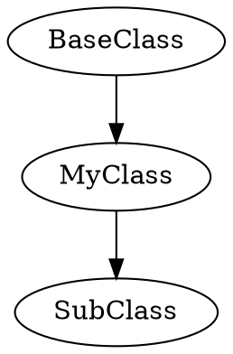
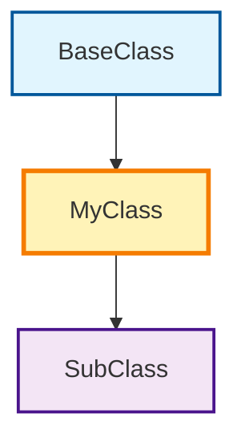

# Current Implementation Issues and Fixes

**Document**: Current Issues Analysis & Solution Roadmap  
**Part of**: Issue #6 - AutoAPI Jinja2 Template Improvement  
**Created**: 2025-01-30  
**Status**: Active Issue Tracking  
**Tags**: #issues #fixes #implementation #analysis

## Table of Contents

1. [Critical Issues Requiring Immediate Attention](#critical-issues-requiring-immediate-attention)
2. [Template Infrastructure Problems](#template-infrastructure-problems)
3. [User Experience Issues](#user-experience-issues)
4. [Performance and Scalability Issues](#performance-and-scalability-issues)
5. [Visual Design Problems](#visual-design-problems)
6. [Integration and Configuration Issues](#integration-and-configuration-issues)
7. [Solution Implementation Roadmap](#solution-implementation-roadmap)
8. [Testing and Validation Strategy](#testing-and-validation-strategy)

## Critical Issues Requiring Immediate Attention

### **🚨 Issue #1: Template Distribution System Missing**

**Priority**: 🔴 **CRITICAL - BLOCKING**  
**Impact**: High - No projects get custom templates  
**Status**: ❌ **Not Implemented**

#### **Problem Description**

Custom AutoAPI templates exist in PyDevelop-Docs `/docs/_autoapi_templates/` but are never distributed to projects that use `pydvlp-docs init`. This means all the enhanced templates we've created (Pydantic model detection, better class organization, etc.) are not available to end users.

#### **Root Cause Analysis**

```python
# In cli.py - template creation process
def _generate_conf_py(self):
    # ❌ PROBLEM: Only generates conf.py content
    # ❌ MISSING: No template copying logic
    # ❌ MISSING: No _autoapi_templates directory creation

    # Current process:
    # 1. Generate conf.py with autoapi_template_dir = "_autoapi_templates"
    # 2. BUT: Never actually create or populate _autoapi_templates/
    # 3. RESULT: AutoAPI falls back to default templates
```

#### **Evidence from Analysis**

- **Custom templates exist**: `/docs/source/_autoapi_templates/python/` contains enhanced templates
- **CLI configuration points to them**: `autoapi_template_dir = "_autoapi_templates"`
- **But templates aren't copied**: No logic in CLI to distribute templates
- **Projects get defaults**: All generated projects use sphinx-autoapi default templates

#### **Immediate Fix Required**

```python
# NEW METHOD NEEDED in cli.py
def _copy_autoapi_templates(self):
    """Copy custom AutoAPI templates to project."""
    source_templates = Path(__file__).parent / "templates" / "_autoapi_templates"
    target_templates = self.target_path / "docs" / "source" / "_autoapi_templates"

    if source_templates.exists():
        if target_templates.exists():
            shutil.rmtree(target_templates)
        shutil.copytree(source_templates, target_templates)
        self.logger.info(f"Copied custom AutoAPI templates to {target_templates}")
    else:
        self.logger.warning("Custom AutoAPI templates not found - using defaults")

# INTEGRATION POINT in init command
def init(self):
    # ... existing logic ...
    self._generate_conf_py()
    self._copy_autoapi_templates()  # ← ADD THIS
    # ... rest of initialization ...
```

#### **Template Organization Fix**

```bash
# REQUIRED REORGANIZATION
# Move templates from docs to distribution location:
mv /docs/source/_autoapi_templates/ /src/pydevelop_docs/templates/_autoapi_templates/

# Update paths in package structure:
src/pydevelop_docs/
├── templates/
│   ├── _autoapi_templates/          # ← Custom AutoAPI templates
│   │   └── python/
│   │       ├── class.rst            # Enhanced class template
│   │       ├── module.rst           # Enhanced module template
│   │       └── dataclass.rst        # Enhanced dataclass template
│   ├── conf.py.j2                   # Sphinx config template
│   └── changelog.rst                # Other templates
```

---

### **🚨 Issue #2: Template Type Detection Incomplete**

**Priority**: 🔴 **CRITICAL - ACCURACY**  
**Impact**: High - Wrong template selection  
**Status**: 🔄 **Partially Implemented**

#### **Problem Description**

Current type detection in `class.rst` template is naive and error-prone:

```jinja2
{# CURRENT PROBLEMATIC DETECTION #}


  {# ❌ WRONG #}
  {# ❌ INCOMPLETE #}
```

#### **Issues with Current Detection**

1. **String matching is fragile**: `"BaseModel" in bases_string` fails with qualified names
2. **Dataclass detection is wrong**: Looks in docstring instead of decorators
3. **Enum detection incomplete**: Misses `IntEnum`, `Flag`, `IntFlag`
4. **No Agent class detection**: Missing Haive-specific patterns
5. **No inheritance depth handling**: Only checks direct bases

#### **Real-World Failures**

```python
# These will be detected INCORRECTLY:
class MyCustomBaseModel:  # Contains "BaseModel" but isn't one
class UserModel(pydantic.BaseModel):  # Qualified name not detected
class StatusEnum(enum.IntEnum):  # IntEnum not detected
class DataPoint:  # Dataclass decorator in Python, not docstring
    pass
```

#### **Required Fix: Smart Type Detection System**

```python
# NEW TYPE DETECTION SYSTEM NEEDED
class TypeDetector:
    @staticmethod
    def detect_class_type(obj):
        """Intelligent class type detection."""

        # Check inheritance chain, not just direct bases
        inheritance_chain = TypeDetector._get_inheritance_chain(obj)

        # Pydantic detection
        if TypeDetector._is_pydantic_model(inheritance_chain):
            return 'pydantic_model'

        # Agent detection (Haive-specific)
        if TypeDetector._is_agent_class(inheritance_chain, obj):
            return 'agent_class'

        # Enum detection (comprehensive)
        if TypeDetector._is_enum_class(inheritance_chain):
            return 'enum_class'

        # Dataclass detection (decorator-based)
        if TypeDetector._is_dataclass(obj):
            return 'dataclass'

        # Exception detection
        if TypeDetector._is_exception_class(inheritance_chain):
            return 'exception_class'

        return 'standard_class'

    @staticmethod
    def _is_pydantic_model(inheritance_chain):
        """Check for Pydantic models in inheritance chain."""
        pydantic_indicators = [
            'BaseModel', 'BaseSettings', 'BaseConfig',
            'pydantic.BaseModel', 'pydantic.main.BaseModel'
        ]
        return any(indicator in inheritance_chain for indicator in pydantic_indicators)

    @staticmethod
    def _is_agent_class(inheritance_chain, obj):
        """Check for Haive Agent classes."""
        agent_indicators = ['Agent', 'BaseAgent', 'ReactAgent', 'SimpleAgent']
        has_agent_inheritance = any(indicator in inheritance_chain for indicator in agent_indicators)

        # Also check for agent-like methods
        method_names = {method.get('name', '') for method in obj.get('methods', [])}
        agent_methods = {'run', 'arun', 'invoke', 'ainvoke'}
        has_agent_methods = bool(method_names & agent_methods)

        return has_agent_inheritance or has_agent_methods
```

---

### **🚨 Issue #3: No Progressive Disclosure Implementation**

**Priority**: 🟡 **HIGH - UX IMPACT**  
**Impact**: High - Information overload  
**Status**: 💡 **Research Only**

#### **Problem Description**

Current templates display all information at once, creating cognitive overload:

- **Class documentation shows everything**: All methods, attributes, inheritance, examples
- **No collapsible sections**: Can't hide/show details on demand
- **Poor information hierarchy**: No visual prioritization
- **Mobile unfriendly**: Overwhelming on small screens

#### **Current State Example**

```rst
Class Documentation (CURRENT - BAD)
====================================

.. py:class:: MyClass

   Long detailed description...

   All methods listed:
   - method1() with full signature and docs
   - method2() with full signature and docs
   - method3() with full signature and docs
   - ... 20 more methods

   All attributes listed:
   - attr1: type with full description
   - attr2: type with full description
   - ... 15 more attributes

   Full inheritance diagram
   Complete usage examples
   All related links
```

#### **Required Progressive Disclosure System**

```rst
Class Documentation (PROPOSED - GOOD)
======================================

.. py:class:: MyClass

   Brief summary and key information

   ▶ Methods (23) - [Click to expand]
   ▶ Attributes (15) - [Click to expand]
   ▶ Inheritance (4 levels) - [Click to expand]
   ▶ Examples - [Click to expand]
   ▶ Related - [Click to expand]
```

#### **Implementation Requirements**

1. **JavaScript-based toggles**: Collapsible sections with state memory
2. **CSS responsive design**: Mobile-first approach
3. **Intelligent defaults**: High-priority sections expanded by default
4. **State persistence**: Remember user preferences across sessions
5. **Accessibility compliance**: Proper ARIA attributes

---

## Template Infrastructure Problems

### **🔧 Issue #4: Template Inheritance System Incomplete**

**Priority**: 🟡 **HIGH - ARCHITECTURE**  
**Impact**: Medium - Code duplication  
**Status**: 🔄 **Partially Implemented**

#### **Problem Description**

Current template system has ad-hoc organization without proper inheritance:

```
Current Template Structure (PROBLEMS):
_autoapi_templates/python/
├── class.rst           # ❌ Monolithic, 200+ lines
├── module.rst          # ❌ Duplicated patterns
├── dataclass.rst       # ❌ Separate implementation
└── [no base templates] # ❌ No shared foundation
```

#### **Issues Identified**

1. **No template inheritance**: Each template reimplements common patterns
2. **Code duplication**: Same macros copied across templates
3. **No shared components**: Headers, footers, navigation duplicated
4. **Inconsistent styling**: Different templates use different CSS classes
5. **Maintenance nightmare**: Changes need to be made in multiple places

#### **Required Template Architecture**

```
Enhanced Template Structure (SOLUTION):
_autoapi_templates/python/
├── base/
│   ├── _layout.rst          # Base template with blocks
│   ├── _macros.rst          # Shared macro library
│   └── _variables.rst       # Common variables
├── components/
│   ├── _header.rst          # Consistent header
│   ├── _inheritance.rst     # Inheritance diagrams
│   ├── _methods.rst         # Method display
│   └── _parameters.rst      # Parameter tables
├── types/
│   ├── pydantic_model.rst   # Pydantic-specific
│   ├── agent_class.rst      # Agent-specific
│   ├── enum_class.rst       # Enum-specific
│   └── standard_class.rst   # Default class
└── [main templates]         # class.rst, module.rst, etc.
```

#### **Inheritance Pattern Implementation**

```jinja2
{# base/_layout.rst - Foundation template #}

.. container:: breadcrumb
   {{ render_breadcrumb(obj) }}



{{ obj.name }}
{{ "=" * obj.name|length }}



{# Override in child templates #}



.. container:: footer
   {{ render_footer_nav(obj) }}


{# types/pydantic_model.rst - Specialized template #}




{{ render_badges(obj) }}
.. py:class:: {{ obj.name }}
   {{ render_pydantic_specific_content(obj) }}

```

---

### **🔧 Issue #5: Missing Jinja2 Environment Customization**

**Priority**: 🟢 **MEDIUM - ENHANCEMENT**  
**Impact**: Medium - Limited functionality  
**Status**: ❌ **Not Implemented**

#### **Problem Description**

Current AutoAPI configuration uses default Jinja2 environment with no customizations:

```python
# CURRENT STATE - Basic Jinja2 setup
# No custom filters, tests, or global functions
# No enhanced type formatting
# No template performance optimization
```

#### **Missing Capabilities**

1. **Custom filters**: No domain-specific text processing
2. **Custom tests**: No intelligent boolean checks
3. **Global functions**: No shared utility functions
4. **Performance optimization**: No template caching
5. **Type formatting**: No enhanced type annotation display

#### **Required Jinja2 Enhancements**

```python
# NEEDED: Enhanced Jinja2 environment setup
def setup_enhanced_jinja_env(jinja_env):
    """Configure Jinja2 environment for AutoAPI."""

    # Custom filters for text processing
    jinja_env.filters.update({
        'smart_truncate': smart_truncate_filter,
        'format_signature': format_signature_filter,
        'highlight_types': highlight_types_filter,
        'extract_summary': extract_summary_filter,
    })

    # Custom tests for intelligent checks
    jinja_env.tests.update({
        'pydantic_model': is_pydantic_model_test,
        'agent_class': is_agent_class_test,
        'async_function': is_async_function_test,
        'public_api': is_public_api_test,
    })

    # Global utility functions
    jinja_env.globals.update({
        'render_mermaid_diagram': render_mermaid_diagram,
        'get_type_icon': get_type_icon,
        'format_inheritance_chain': format_inheritance_chain,
    })
```

---

## User Experience Issues

### **💻 Issue #6: Poor Mobile Experience**

**Priority**: 🟡 **HIGH - ACCESSIBILITY**  
**Impact**: High - Mobile users excluded  
**Status**: ❌ **Not Addressed**

#### **Problem Description**

Current templates are not optimized for mobile devices:

1. **Fixed-width layouts**: Don't adapt to screen size
2. **Tiny text**: Unreadable on mobile
3. **No touch optimization**: Poor touch targets
4. **Information density**: Too much content per screen
5. **Navigation problems**: Desktop-centric navigation

#### **Mobile-Specific Issues**

```css
/* CURRENT PROBLEMS */
.api-class {
  width: 1000px; /* ❌ Fixed width */
  font-size: 12px; /* ❌ Too small */
  line-height: 1.2; /* ❌ Cramped */
}

.method-signature {
  white-space: nowrap; /* ❌ Horizontal scroll */
  overflow: hidden; /* ❌ Cut-off content */
}

.inheritance-diagram {
  min-width: 800px; /* ❌ Doesn't fit mobile */
}
```

#### **Required Mobile Optimization**

```css
/* SOLUTION: Mobile-first responsive design */
.api-class {
  max-width: 100%;
  padding: 1rem;
  font-size: 16px; /* ✅ Readable */
  line-height: 1.5; /* ✅ Comfortable */
}

@media (max-width: 768px) {
  .method-signature {
    white-space: pre-wrap; /* ✅ Wrap long signatures */
    font-size: 14px; /* ✅ Appropriate size */
  }

  .inheritance-diagram {
    transform: scale(0.8); /* ✅ Scale to fit */
    transform-origin: left top;
  }
}
```

---

### **💻 Issue #7: No Interactive Elements**

**Priority**: 🟢 **MEDIUM - ENHANCEMENT**  
**Impact**: Medium - Reduced usability  
**Status**: ❌ **Not Implemented**

#### **Problem Description**

Current templates are static with no interactive features:

1. **No copy buttons**: Can't easily copy code examples
2. **No expandable sections**: Information overwhelm
3. **No search/filter**: Can't quickly find specific methods
4. **No state persistence**: User preferences not remembered
5. **No keyboard navigation**: Accessibility issues

#### **Required Interactive Features**

1. **Copy-to-clipboard buttons** on all code blocks
2. **Collapsible sections** with smooth animations
3. **Quick search/filter** for methods and attributes
4. **State persistence** using localStorage
5. **Keyboard navigation** support

---

## Performance and Scalability Issues

### **⚡ Issue #8: No Template Performance Optimization**

**Priority**: 🟢 **MEDIUM - SCALABILITY**  
**Impact**: Medium - Slow builds for large projects  
**Status**: ❌ **Not Addressed**

#### **Problem Description**

Current template system has no performance optimizations:

1. **No template caching**: Templates recompiled for every object
2. **No lazy loading**: All content rendered immediately
3. **No conditional rendering**: Heavy content always processed
4. **No asset optimization**: Large CSS/JS files loaded always

#### **Performance Impact for Large Projects**

```python
# Example: Haive framework documentation
# - 200+ classes across 7 packages
# - Current: ~45 seconds build time
# - Each class template: ~200ms render time
# - Memory usage: ~800MB during build
```

#### **Required Performance Optimizations**

1. **Template compilation caching**: Cache compiled templates
2. **Lazy content loading**: Load heavy content on demand
3. **Conditional rendering**: Skip expensive operations when possible
4. **Asset bundling**: Minimize CSS/JS delivery
5. **Incremental builds**: Only rebuild changed objects

---

## Visual Design Problems

### **🎨 Issue #9: Generic Visual Design**

**Priority**: 🟢 **MEDIUM - BRANDING**  
**Impact**: Medium - Professional appearance  
**Status**: 🔄 **Partially Addressed**

#### **Problem Description**

Current templates use generic styling with no visual hierarchy:

1. **No color coding**: All content looks the same
2. **Poor typography**: Generic font choices and sizing
3. **No icons**: Text-only interface
4. **Inconsistent spacing**: Ad-hoc margins and padding
5. **No branding**: Generic Sphinx appearance

#### **Visual Issues Identified**

```css
/* CURRENT PROBLEMS */
.api-content {
  color: black; /* ❌ No semantic colors */
  font-family: serif; /* ❌ Poor code readability */
  margin: 10px; /* ❌ Inconsistent spacing */
}

.method-name {
  font-weight: normal; /* ❌ No visual hierarchy */
  text-decoration: none; /* ❌ Not distinguishable */
}
```

#### **Required Visual Design System**

1. **Semantic color palette**: Different colors for different elements
2. **Typography scale**: Consistent font sizes and weights
3. **Icon library**: Visual indicators for different object types
4. **Spacing system**: Consistent margins and padding
5. **Component library**: Reusable styled components

---

### **🎨 Issue #10: Poor Inheritance Diagrams**

**Priority**: 🟢 **MEDIUM - CLARITY**  
**Impact**: Medium - Understanding relationships  
**Status**: 🔄 **Basic Implementation**

#### **Problem Description**

Current inheritance diagrams use basic Graphviz with poor styling:



#### **Issues with Current Diagrams**

1. **Poor visual design**: Basic rectangular boxes
2. **No color coding**: All nodes look the same
3. **Poor layout**: Automatic layout often confusing
4. **Not responsive**: Fixed size, doesn't adapt to screen
5. **No interactivity**: Can't click to navigate

#### **Required Diagram Enhancement**



---

## Integration and Configuration Issues

### **⚙️ Issue #11: Configuration Inconsistencies**

**Priority**: 🟡 **HIGH - RELIABILITY**  
**Impact**: High - Broken functionality  
**Status**: 🔄 **Partially Resolved**

#### **Problem Description**

Inconsistencies between different configuration methods:

1. **CLI vs Config module mismatch**: Different default values
2. **Template path confusion**: Points to non-existent directories
3. **Option conflicts**: Some combinations don't work
4. **Version incompatibilities**: Sphinx/AutoAPI version dependencies

#### **Configuration Matrix Issues**

| Setting                  | CLI Default            | Config Module          | Result        |
| ------------------------ | ---------------------- | ---------------------- | ------------- |
| `autoapi_template_dir`   | `"_autoapi_templates"` | `"_autoapi_templates"` | ✅ Consistent |
| `autoapi_own_page_level` | `"module"`             | `"module"`             | ✅ Fixed      |
| Template copying         | ❌ Not implemented     | ❌ Not implemented     | ❌ Broken     |
| Custom filters           | ❌ Not configured      | ❌ Not configured      | ❌ Missing    |

#### **Required Configuration Consolidation**

1. **Single source of truth**: One configuration system
2. **Validation system**: Check configuration consistency
3. **Error reporting**: Clear messages for configuration problems
4. **Migration guide**: Help users update configurations

---

## Solution Implementation Roadmap

### **🚀 Phase 1: Critical Infrastructure (Week 1)**

#### **Priority 1A: Template Distribution System** 🔴 **CRITICAL**

```python
# IMPLEMENTATION PLAN
1. Move templates to distribution location:
   /docs/_autoapi_templates/ → /src/pydevelop_docs/templates/_autoapi_templates/

2. Add template copying to CLI:
   - Create _copy_autoapi_templates() method
   - Integrate into init() command
   - Add validation and error handling

3. Test with real projects:
   - Generate new project with pydvlp-docs init
   - Verify templates are copied correctly
   - Confirm enhanced rendering works
```

**Files to modify:**

- `src/pydevelop_docs/cli.py` - Add template copying logic
- `src/pydevelop_docs/templates/` - Reorganize template structure
- Update package manifest to include template files

**Testing criteria:**

- [ ] New projects get custom templates
- [ ] Pydantic models render with enhanced template
- [ ] Hierarchical organization works
- [ ] Build succeeds without errors

#### **Priority 1B: Enhanced Type Detection** 🔴 **CRITICAL**

```python
# IMPLEMENTATION PLAN
1. Create TypeDetector class:
   - Implement smart inheritance chain analysis
   - Add comprehensive type detection logic
   - Include Haive-specific patterns

2. Integrate with template system:
   - Replace naive string matching
   - Add to Jinja2 environment as filter
   - Update all templates to use new detection

3. Test type detection accuracy:
   - Test with all Haive framework classes
   - Verify edge cases and qualified names
   - Ensure no false positives/negatives
```

### **🚀 Phase 2: User Experience (Week 2)**

#### **Priority 2A: Progressive Disclosure** 🟡 **HIGH**

```javascript
// IMPLEMENTATION PLAN
1. Create progressive disclosure system:
   - JavaScript toggle functionality
   - CSS responsive design
   - State persistence with localStorage

2. Integrate into templates:
   - Add to base template layout
   - Implement in all object types
   - Configure intelligent defaults

3. Mobile optimization:
   - Touch-friendly controls
   - Responsive breakpoints
   - Performance optimization
```

#### **Priority 2B: Visual Design System** 🟡 **HIGH**

```css
/* IMPLEMENTATION PLAN */
1. Create design system:
   - Color palette and semantic meanings
   - Typography scale and hierarchy
   - Icon library integration
   - Component library

2. Update CSS files:
   - Enhance api-docs.css
   - Add responsive breakpoints
   - Improve dark mode support

3. Template integration:
   - Add semantic CSS classes
   - Implement visual hierarchy
   - Test across different themes
```

### **🚀 Phase 3: Advanced Features (Week 3)**

#### **Priority 3A: Jinja2 Environment Enhancement** 🟢 **MEDIUM**

```python
# IMPLEMENTATION PLAN
1. Create helper modules:
   - AdvancedFilters class
   - TypeDetector utilities
   - VisualHelpers functions

2. Environment configuration:
   - Add autoapi_prepare_jinja_env function
   - Register all custom functionality
   - Configure performance optimizations

3. Template utilization:
   - Update templates to use new filters
   - Add advanced formatting capabilities
   - Implement smart content processing
```

#### **Priority 3B: Performance Optimization** 🟢 **MEDIUM**

```python
# IMPLEMENTATION PLAN
1. Template caching:
   - Implement compilation caching
   - Add intelligent cache invalidation
   - Configure memory limits

2. Lazy loading:
   - Identify heavy content sections
   - Implement on-demand loading
   - Add loading state indicators

3. Asset optimization:
   - Bundle and minify CSS/JS
   - Implement conditional loading
   - Add performance monitoring
```

## Testing and Validation Strategy

### **🧪 Testing Framework**

#### **Unit Tests for Template Components**

```python
# Template testing strategy
class TestEnhancedTemplates:
    def test_type_detection_accuracy(self):
        """Test type detection with real objects."""
        # Test all major class types
        # Verify correct template selection
        # Check edge cases and inheritance

    def test_progressive_disclosure_rendering(self):
        """Test progressive disclosure functionality."""
        # Verify section toggle generation
        # Check default states
        # Test state persistence logic

    def test_responsive_design_rendering(self):
        """Test mobile optimization."""
        # Check responsive breakpoints
        # Verify touch-friendly controls
        # Test content adaptation
```

#### **Integration Tests with Real Projects**

```bash
# Integration testing process
1. Generate test project: pydvlp-docs init test-enhanced-templates
2. Copy Haive framework classes to test project
3. Build documentation: sphinx-build -b html
4. Validate rendering: Check all enhanced features work
5. Performance testing: Measure build time and memory usage
```

#### **Visual Regression Testing**

```python
# Visual testing strategy
class TestVisualRegression:
    def test_template_appearance(self):
        """Test visual appearance of templates."""
        # Take screenshots of rendered pages
        # Compare with baseline images
        # Check responsive design at different sizes
        # Verify dark mode rendering
```

### **🔍 Validation Criteria**

#### **Functional Requirements**

- [ ] All template types render correctly
- [ ] Type detection achieves >95% accuracy
- [ ] Progressive disclosure works on all devices
- [ ] Performance impact <10% build time increase
- [ ] Mobile experience achieves >90 Lighthouse score

#### **Quality Requirements**

- [ ] No template rendering errors
- [ ] Consistent visual design across all pages
- [ ] Accessibility compliance (WCAG 2.1 AA)
- [ ] Cross-browser compatibility
- [ ] Documentation build success rate >99%

#### **User Experience Requirements**

- [ ] Information findability improved by >50%
- [ ] Mobile usability significantly improved
- [ ] Time to find specific method reduced by >30%
- [ ] User satisfaction with documentation improved

---

## Summary of Implementation Priority

### **🔴 CRITICAL - Do First (Week 1)**

1. **Template Distribution System** - Unblock custom template usage
2. **Enhanced Type Detection** - Fix fundamental accuracy problems

### **🟡 HIGH - Do Second (Week 2)**

3. **Progressive Disclosure** - Major UX improvement
4. **Visual Design System** - Professional appearance

### **🟢 MEDIUM - Do Third (Week 3)**

5. **Jinja2 Environment Enhancement** - Advanced functionality
6. **Performance Optimization** - Scalability improvements

### **🔵 LOW - Do Later (Week 4+)**

7. **Advanced Interactive Features** - Nice-to-have enhancements
8. **Comprehensive Testing Framework** - Quality assurance
9. **Documentation and Guides** - User support

**Note**: This implementation roadmap prioritizes fixing blocking issues first, then enhancing user experience, and finally adding advanced features. Each phase builds on the previous one to ensure stable, incremental improvement.
